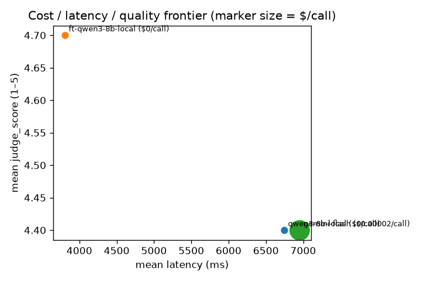
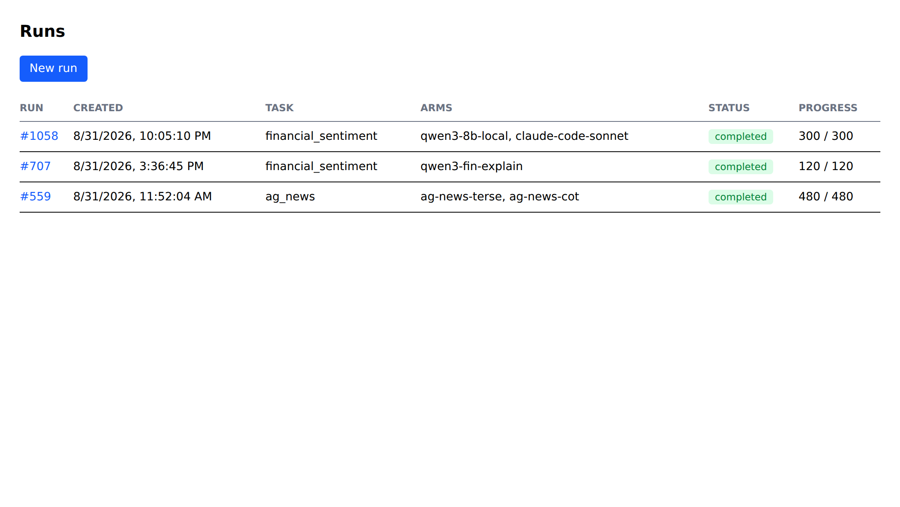
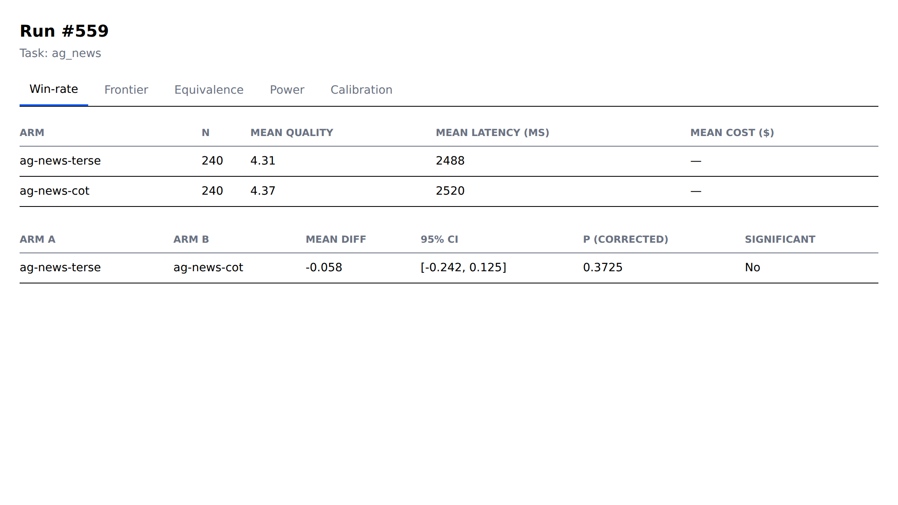
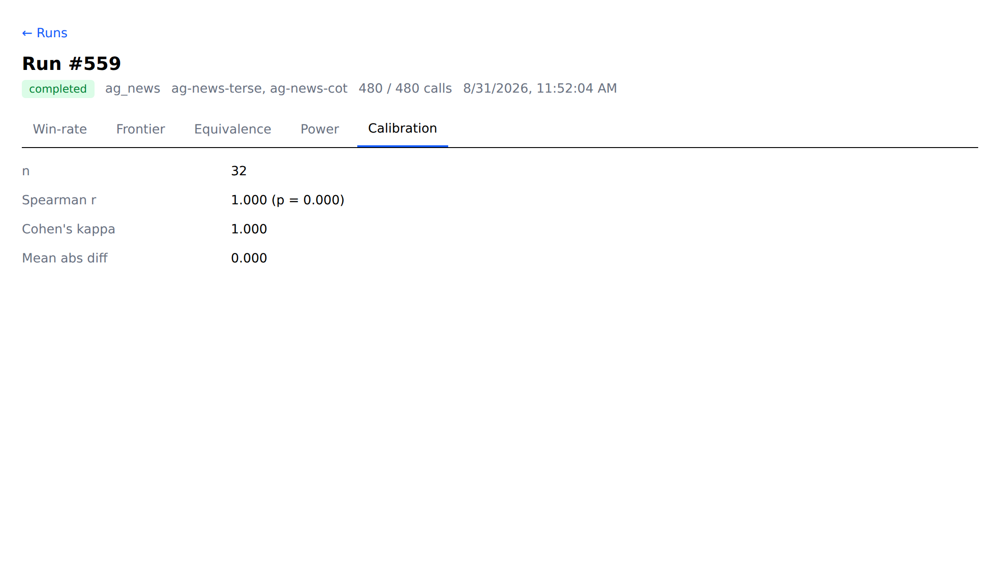

# LLM Evaluation & Prompt-Experimentation Platform

Treats LLM prompts and models as **experiment arms** and compares them with
the statistical rigor of an A/B test — paired significance tests, a Bayesian
equivalence test, and an LLM judge calibrated against human labels — instead
of a single leaderboard number. Local (Ollama) and hosted-API models are
interchangeable, first-class arms in the same paired comparison, declared in
`backend/arms.yaml` with no code changes.

## Result: a QLoRA fine-tune beats base Qwen3-8B — and the paired test proves it

50 financial-sentiment examples × 3 repeats per arm, same eval harness, LLM
judge for quality ([full report](docs/superpowers/reports/2026-08-30-finetune-comparison.md)):

| | base `qwen3:8b` | QLoRA fine-tune | paired result |
|---|---|---|---|
| judge accuracy | 80.0% | **90.0%** | Wilcoxon **p = 0.031** (Holm-corrected) |
| Bayesian posterior Δ | — | — | **+0.30**, 94% CI [+0.07, +0.53], entirely above 0 |
| latency / call | 6,744 ms | **3,804 ms** | −2,939 ms (1.77× faster), p = 1.6e-10 |
| output tokens / call | 296.6 | **6.0** | ~49× fewer, p < 1e-15 |



A second experiment — a prompt A/B on AG News of a terse instruction vs. a
"reason step by step" one — found **quality is a wash** (paired Wilcoxon
corrected p = 0.37, Bayesian P(equivalent) = 1.00 at ε = 0.5) while CoT costs
**~40× the output tokens**; an unpaired win-rate would have misread the 1.6-pt
noise gap as a CoT win
([full report](docs/superpowers/reports/2026-08-31-prompt-ab-comparison.md)).

A third experiment **calibrates the LLM judge** against 50 hand-labeled
financial-sentiment rows (blind to the judge's score): perfect agreement on
label-correctness (Cohen's κ = 1.00), and the one disagreement pattern is the
judge collapsing the 1–5 rubric to a binary
([full report](docs/superpowers/reports/2026-08-31-judge-calibration-financial.md)).

A fourth experiment answers the headline question with a **hosted arm**:
local `qwen3:8b` vs. `claude-code-sonnet` (the `claude` CLI under a Max seat,
no per-token bill), 150 Financial PhraseBank sentences. **Quality is not
significantly different** (paired Wilcoxon corrected p = 0.10; 87.3% vs 92.0%
raw accuracy; Bayesian P(within ±0.5) = 1.00, though underpowered at n = 150).
Median latency is comparable (3.8 s vs 2.4 s); the local arm's weakness is a
long latency tail under memory pressure, not headline quality
([full report](docs/superpowers/reports/2026-09-01-local-vs-cli-hosted.md)).

**[`docs/RESULTS.md`](docs/RESULTS.md) is the readable walk-through of all
four** — the question, what each found, and the remaining gap below.

> **Remaining gap:** the hosted arm above is a flat-rate *subscription* seat,
> not a *metered* per-token API — so the cost/quality frontier still has no
> real dollar figure on its x-axis. A metered arm (GPT-4o-mini / Gemini /
> Claude API) needs a paid key; the free Gemini tier 429'd 130/150 calls. The
> pipeline is ready for it.

## Dashboard

React app: run list with live status polling, and a per-run tabbed view —
paired win-rate table, cost/latency/quality frontier, judge calibration
report. Regenerate these with `node frontend/scripts/screenshot_dashboard.mjs`
against a running stack.

| Run list | Paired win-rate table | Judge calibration |
|---|---|---|
|  |  |  |

## Architecture

```
[eval dataset] -> [model arms: local + API] -> [orchestrator + results store]
               -> [LLM-as-judge, calibrated] -> [stats analysis + dashboard]
```

- **Backend** — FastAPI + Celery/Redis orchestration, Postgres results store,
  Alembic migrations (`backend/`)
- **Model arms** — `OpenAICompatibleAdapter` (Ollama, OpenAI, OpenRouter,
  Groq, ...), `AnthropicAdapter`, plus two subscription-seat CLI adapters
  (`ClaudeCodeCLIAdapter`, `CodexCLIAdapter`) — declared in
  `backend/arms.yaml`, no code changes to add or swap a provider. **Prompts
  are arms too**: an arm carries an optional `prompt_template`, so two arms
  with the same model but different templates A/B the prompts under the same
  paired stats.
- **Tasks are packs** — a task is a directory under `backend/tasks/<name>/`
  (label set, eval prompt, judge rubric, data file). `arms.yaml`'s `task:`
  key selects the active one; bring-your-own eval = drop in a JSONL + a
  `task.yaml`, no code change. Ships with `financial_sentiment` and `ag_news`.
- **Judge layer** — rubric-based LLM-as-judge, calibrated against a
  hand-labeled gold subset (Spearman + Cohen's κ) before scores are trusted
- **Stats layer** — hierarchical paired bootstrap + Wilcoxon signed-rank +
  Holm-Bonferroni correction, PyMC Bayesian equivalence test, closed-form
  sample-size / power calculator (`backend/app/stats/`)
- **`pe` CLI** — one entrypoint over the whole loop (stack lifecycle, seeding,
  runs, stats, calibration)
- **MCP judge tool** — `score_output_against_gold` (server `rubric-judge`),
  for scoring a single candidate response from a Claude Code session

Full write-up — motivation, the five core differentiators, build-phase
history — is in [`CLAUDE.md`](CLAUDE.md). Executed experiments are under
[`docs/superpowers/reports/`](docs/superpowers/reports/).

## Getting started

Two ways in, depending on what you want.

### Path A — score one response against a gold label (MCP, no Docker)

The lightweight path: a coding agent (or any MCP client) gets a single
calibrated 1–5 judge score for one candidate output. No database, no
orchestrator — just the judge.

**Needs:** [`uv`](https://docs.astral.sh/uv/) and a judge model reachable.
The default judge is a local Ollama (`ollama serve`, `ollama pull qwen3:8b`),
which is keyless and offline; point `judge:` in `backend/arms.yaml` at a
hosted model instead if you prefer (key goes in `backend/.env`).

The repo-root [`.mcp.json`](.mcp.json) registers the server. In a Claude Code
session opened in this repo, approve the project-scoped `rubric-judge` server
when prompted, then call:

```
score_output_against_gold(
  input_text  = "Net sales fell by 5% from the previous period.",
  gold_label  = "negative",          # must be one of the active task's labels
  model_output = "The sentiment is negative because sales declined.",
)
→ { score: 5, rationale: "...", judge_model: "qwen3:8b", task: "financial_sentiment" }
```

The active task (its label set + rubric) comes from `arms.yaml`'s `task:`
key. From another MCP client, run the server directly:
`uv run --directory backend python -m app.mcp_judge_server`. Signature and
error cases: "Phase 6" in `backend/README.md`.

That is the whole of Path A. It does **not** give you paired comparisons,
repeated runs, calibration, or the dashboard — for those, use Path B.

### Path B — run the full A/B eval platform

**Needs:** [Docker](https://www.docker.com/) + Compose, `uv`, and a native
Ollama on the host (`ollama serve`, `ollama pull qwen3:8b`) listening on
`0.0.0.0` (see below). A GPU in practice — `qwen3:8b` on CPU is very slow.
Optionally, API keys for hosted arms.

```bash
cp .env.example .env    # set POSTGRES_PASSWORD and OLLAMA_BASE_URL (see below);
                        # fill in any API keys you have
docker compose up --build
# dashboard → http://localhost:5173   API → http://localhost:8000
```

Then drive the whole loop with the `pe` CLI (from `backend/`, `uv` syncs on
first use):

```bash
cd backend
uv run pe up                                      # compose up -d, wait for API
uv run pe seed                                    # seed the eval dataset (idempotent)
uv run pe run --sample 20 --repeats 3 --seed 42   # start a run, prints run_id
uv run pe watch 1                                 # poll until it finishes (arm calls + judge)
uv run pe stats compare 1                         # paired Wilcoxon + bootstrap CI + Holm
uv run pe stats equivalence 1 --local A --api B    # Bayesian P(local ≥ api − ε)
uv run pe calibrate select --run-id 1 --n 50 --out cal.json   # then hand-label,
uv run pe calibrate import --in cal.json --labeled-by you     # import, and
uv run pe calibrate report --run-id 1                         # check judge agreement
uv run pe --help                                  # every command

./scripts/demo.sh                      # or: the whole happy path end to end
DEMO_TASK=ag_news ./scripts/demo.sh    # ...against the non-financial pack
```

Runs can also be started from the dashboard's **New run** button, or the raw
API (`curl -X POST localhost:8000/runs -d '{"sample_size": 20, "repeats": 3}'`).

**Bring your own model or prompt** — add an entry to `backend/arms.yaml` (a
provider + model, or the same model with a different `prompt_template`), no
code change. **Bring your own eval** — drop a `task.yaml` + a `.jsonl` under
`backend/tasks/<name>/` and point `arms.yaml`'s `task:` at it.

### Connecting the local Ollama from Docker

Ollama runs natively on the host, not in a container. `arms.yaml` points
`qwen3-8b-local` at `http://localhost:11434/v1` for the non-Docker flow; from
inside a container that doesn't resolve to the host. **Don't edit
`arms.yaml`** — set `OLLAMA_BASE_URL` in `.env`, which redirects every
arm/judge pointed at a local Ollama (`localhost`/`127.0.0.1` on `:11434`)
while leaving hosted providers on the same adapter untouched:

```bash
# .env — try host.docker.internal first; on Docker Desktop + WSL2 that
# gateway may refuse the connection, in which case use the WSL eth0 IP
# (`ip addr show eth0 | grep inet`), which is not stable across `wsl --shutdown`.
OLLAMA_BASE_URL=http://host.docker.internal:11434/v1
```

Ollama must also listen on `0.0.0.0`, not loopback-only — set
`OLLAMA_HOST=0.0.0.0:11434` in its environment and restart it. On Docker
Desktop + WSL2, if a container's `/app/arms.yaml` doesn't reflect an edit,
recreate rather than restart: `docker compose up -d --force-recreate api worker`.

**Subscription-seat CLI arms (Claude Code, Codex)** are also not
containerized — run their dedicated `subscription_cli` worker natively on the
host. See "Subscription-seat CLI arms" in `backend/README.md`.

### Without Docker

See `backend/README.md` and `frontend/README.md` for native setup
(`uv sync` / `npm install`, Ollama, migrations, `npm run dev`).

## Tests

```bash
cd backend && uv run pytest -v        # 335 tests
cd frontend && npm run lint && npm run build && npm test
```

The Ollama end-to-end test and the database tests skip automatically when
those services aren't reachable.

## Data & license

The primary eval benchmark is the **Financial PhraseBank** 100%-agreement
subset (2264 sentence-level, 3-class financial-sentiment examples with expert
agreement):

> Malo, P., Sinha, A., Korhonen, P., Wallenius, J., & Takala, P. (2014).
> *Good debt or bad debt: Detecting semantic orientations in economic texts.*
> Journal of the Association for Information Science and Technology, 65(4),
> 782–796.

It is vendored at `backend/data/financial_phrasebank/sentences_allagree.txt`
(regenerate with `backend/scripts/fetch_financial_phrasebank.py`). The judge
calibration workflow stores only row IDs plus human labels, never
redistributed source text.

**The dataset is licensed [CC BY-NC-SA 3.0](http://creativecommons.org/licenses/by-nc-sa/3.0/)**
— attribution, **non-commercial use only**, and share-alike. Those terms bind
this repo's bundled copy and anything derived from it. The eval dataset is a
swap-in point (a task pack), not hardwired into the stats or judge layers: a
commercial user substitutes a permissively-licensed set. Repo code is
separate from the dataset license.

### AG News (secondary task pack, prompt-A/B demo)

The `ag_news` task pack uses **AG News**, a 4-class news-topic benchmark
(World, Sports, Business, Sci/Tech) popularized by:

> Zhang, X., Zhao, J., & LeCun, Y. (2015). *Character-level Convolutional
> Networks for Text Classification.* NeurIPS 28.

The underlying AG corpus is provided for **non-commercial research** only.
Only a 120-row stratified sample (30 per class) is vendored, at
`backend/tasks/ag_news/data.jsonl`; regenerate with
`backend/tasks/ag_news/fetch_ag_news.py`. See
`backend/tasks/ag_news/LICENSE.txt`.

## Tech stack

Python, FastAPI, SQLModel, Celery, Redis, PostgreSQL, Alembic, Ollama,
scipy/statsmodels, PyMC, TypeScript, React, Vite, Docker.
