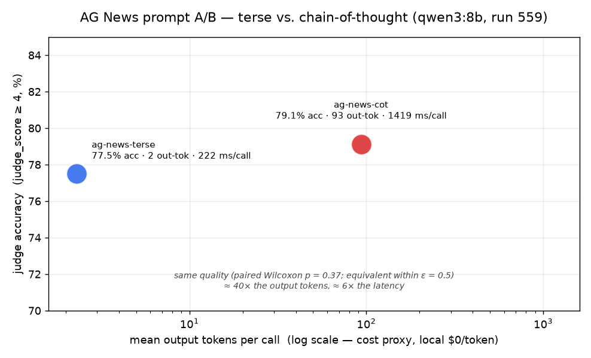

# Prompt A/B — terse vs. chain-of-thought on AG News (Phase 8, Deliverable 2)

Run **559** (`completed`) — arms `ag-news-terse` and `ag-news-cot`, **same
model** (`qwen3:8b`, Ollama, `reasoning_effort: none` so the model's native
thinking is off), **same 120 AG News examples**, 2 repeats each = 240 calls
per arm (480 total, 0 model-call failures). The two arms differ **only** in
`prompt_template`:

| arm | prompt (before `Snippet: {text}`) |
|---|---|
| `ag-news-terse` | *"Classify the topic of the news snippet below as exactly one of: World, Sports, Business, Sci/Tech. Answer with only the label."* |
| `ag-news-cot` | *"…Reason step by step about what the snippet is mainly about, then finish with a final line formatted exactly as `Label: <one of …>`."* |

Quality metric is the LLM judge's 1–5 `judge_score` (judge: local `qwen3:8b`,
native thinking **on**), binarised as `judge_score ≥ 4` = "label correct" for
accuracy. This is the first non-financial task run through the platform — it
exercises the Phase 8 task-pack path (`backend/tasks/ag_news/`) end to end.

> **Task:** AG News topic classification (Zhang, Zhao & LeCun 2015; derived
> from the AG corpus / ComeToMyHead). 4 classes, stratified 120-row sample
> (30/class), `backend/tasks/ag_news/data.jsonl`. Redistributed for
> non-commercial research; only the sample is vendored.

> **Framing:** the point of this deliverable is that a **paired** test
> resolves a small effect that an unpaired win-rate would misread. `ag-news-cot`
> "wins" the raw accuracy count (79.1% vs 77.5%) — a leaderboard would stop
> there. The paired analysis shows that 1.6-point gap is indistinguishable
> from noise, while the *cost* difference (≈40× output tokens) is unambiguous.

## Win-rate / quality (paired)

| comparison | mean Δ `judge_score` | 95% CI | Wilcoxon W | corrected p |
|---|---|---|---|---|
| `ag-news-terse` − `ag-news-cot` | **−0.058** | [−0.242, +0.125] | 109.5 | **0.373** |

Paired hierarchical bootstrap + Wilcoxon signed-rank over the 120 examples
(2 repeats/arm aggregated), Holm-corrected. **No detectable quality
difference.** The CI straddles zero; the point estimate (CoT higher by 0.06
on a 1–5 scale) is trivial.

| arm | correct / n | accuracy |
|---|---|---|
| `ag-news-terse` | 186 / 240 | **77.5%** |
| `ag-news-cot` | 189 / 239¹ | **79.1%** |

¹ one `ag-news-cot` call never produced a parseable judge score (judge
returned an empty completion — native-thinking budget exhausted); it is the
only gap in 480 calls and does not change any conclusion.

The judge emitted almost only **5** (label correct) or **2** (label wrong),
with one **4** and three **1**s — for this task `judge_score` is effectively
a binary accuracy proxy. (The three `1`s were `ag-news-terse` bare wrong
labels the rubric would put at `2` = "wrong but coherent"; minor judge
noise, immaterial to the binary split.)

## Judge calibration (AG News)

A 32-row stratified gold subset (`pe calibrate select/import/report`, run
559) was scored by hand against the AG News gold labels and compared to the
judge:

| n | Spearman r | Cohen's κ (`≥4` = correct) | mean \|Δ\| |
|---|---|---|---|
| 32 | **1.000** | **1.000** | 0.000 |

Perfect agreement. This is expected and not impressive on its own: for a
4-way label match the judge's job is nearly mechanical. The useful result is
the negative one — for AG News the LLM judge introduces essentially no
disagreement with ground truth, so `judge_score` here can be trusted as an
accuracy proxy (unlike an open-ended generation task, where calibration
would carry real information). Labeling was done by the report author against
the dataset's expert labels, not an independent human panel.

## Bayesian equivalence

`metric=judge_score`, ε = 0.5 on the 1–5 scale, `ag-news-cot` as the "local"
side and `ag-news-terse` as the reference:

| | posterior mean Δ (cot − terse) | 94% CI | P(cot ≥ terse − ε) |
|---|---|---|---|
| `ag-news-cot` vs. `ag-news-terse` | **+0.057** | [−0.089, +0.202] | **1.00** |

The whole posterior sits inside ±0.2, far within ε = 0.5 — the two prompts
are **statistically equivalent** in quality. Whatever CoT does for this
model on this task, it is smaller than half a rubric point with probability 1.

## Output efficiency & latency (paired)

| metric | terse | cot | paired mean Δ (cot − terse) | 95% CI | p |
|---|---|---|---|---|---|
| completion tokens / call | 2.3 | 98.0 | **+95.7 (~40× more)** | [+91.8, +99.5] | **2.0e-21** |
| latency / call (run 559, concurrency 4)² | 2,488 ms | 2,520 ms | +32 ms | [−63, +129] | 0.47 |
| latency / call (uncontended, N=24, median)³ | 222 ms | 1,419 ms | **~6×** | — | 9.1e-05 |

² Run 559's per-call latency is **contended** — Celery ran 4 workers against
a single-slot Ollama (`llama-server -np 1`), so every call's wall time is
dominated by queue wait, not its own inference. Under contention the token
difference doesn't show up in latency. Not a clean measurement.

³ A separate sequential micro-benchmark (one request in flight at a time,
same two prompts, 24 examples) gives the real per-call picture: terse
~222 ms / 2 tokens, CoT ~1,419 ms / 93 tokens — **CoT is ~6× slower per
call** (paired Wilcoxon p ≈ 9e-5).

## Cost / latency / quality frontier

Both arms are local (no per-token price), so the cost axis is **output
tokens**. `ag-news-cot` buys **no measurable accuracy** for ~40× the output
tokens and ~6× the per-call latency. On any metered-API arm that token ratio
would be a direct ~40× output-cost multiplier.

## Power

The observed effect size (0.058 SD of the paired difference) would need
**n ≈ 1,582** examples for 80% power; run 559's 120 examples reach ~12%
power *for an effect that small*. This is the honest read: the run is
underpowered to *prove* a 0.06-point difference is exactly zero — but the
equivalence test already bounds any real effect to ±0.2, comfortably inside
any margin that would matter, and the token/latency costs are decisive
regardless.

## Honest read

- **Quality: a wash.** 77.5% vs 79.1% raw, paired Wilcoxon corrected
  p = 0.37, Bayesian posterior +0.06 with the full 94% CI inside ±0.2 and
  P(equivalent) = 1.00 at ε = 0.5. "Reason step by step" does not help
  `qwen3:8b` classify AG News topics.
- **Cost: terse wins decisively.** ~40× fewer output tokens (p ≈ 2e-21),
  ~6× lower uncontended latency (p ≈ 1e-4). Same answer, a fraction of the
  compute.
- **This is the paired-vs-unpaired point.** An unpaired win-rate reads
  "CoT 79.1% > terse 77.5%, CoT is better." The paired test — same 120
  snippets through both prompts — shows that gap is noise, and redirects
  attention to the cost axis, where the difference is real and large. The
  recommendation is `ag-news-terse`.
- **Judge is trustworthy here.** κ = 1.00 vs. hand labels on a stratified
  32-row subset. Safe to read `judge_score` as accuracy for this task.

## Run caveats

- **Judge / arm model overlap.** The judge (`qwen3:8b`) is the same model
  that backs both arms. For a **prompt** A/B this is close to harmless: both
  arms are the identical model, so any self-preference applies equally and
  cancels in the paired difference. (It would matter for a model-vs-model
  comparison — see `backend/README.md` "Watch for judge/arm model overlap".)
- **Interrupted mid-judge.** Docker Desktop was restarted while judge
  scoring was in flight; Redis (no volume) lost the queue. Postgres (volumed)
  kept all 480 model outputs and the 415 judge scores already written; the
  remaining 64 were re-enqueued (`judge_status IN ('pending','failed')` only,
  judge config unchanged, so still one consistent judge pass). Final: 479/480
  judged.
- **Transient judge failures.** ~10 judge calls hit DNS blips during the
  Docker instability and were retried; 1 `ag-news-cot` call never parsed
  (empty judge completion) and is excluded.
- **Latency under contention.** See footnotes 2–3 — the run-559 latency
  column is not a clean per-prompt measurement; the sequential micro-bench is.
- **No metered-API arm.** Both arms are local by design (the A/B is about
  the prompt, not the provider). The ~40× token ratio is what would drive
  cost on any priced provider.
