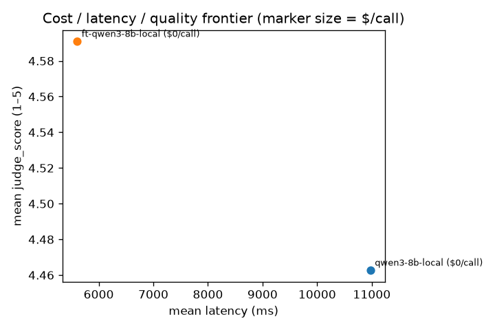

# Fine-tuned vs. base vs. API — financial sentiment (Phase 7)

> **Archived — superseded by `../2026-08-30-finetune-comparison.md` (run 1914).**
> That re-run judged all 150 calls per local arm with one consistent judge; this
> run's paired quality test rests on only 22 examples after a judge rate-limit
> burst. The latency / token results below still hold. Kept for history only.

Run **1731** (`completed`) — arms `qwen3-8b-local` (base) and `ft-qwen3-8b-local`
(QLoRA fine-tune), 50 eval examples × 3 repeats = 150 calls per arm. Seed 11.
Quality metric is the LLM judge's 1–5 `judge_score` (judge: `claude_code_cli`
/ opus). No metered API arm ran — the local `.env` has no `OPENAI_API_KEY` /
`ANTHROPIC_API_KEY` — so this is **base-local vs. fine-tuned-local**, not a
local-vs-API frontier.

> Training data: Financial PhraseBank lower-agreement subset (Malo et al. 2014),
> disjoint from the all-agree eval set (leakage guard: 2259 overlapping rows
> dropped, 2582-row training pool). Licensed CC BY-NC-SA 3.0 (non-commercial).
> Fine-tune: QLoRA r=16, 3 epochs, 807s wall on an RTX 4070 12GB. Eval loss
> 0.0736 → 0.0668 → 0.0769 (mild epoch-3 overfit).

> **Data-quality caveat.** 167 of 300 judge calls failed (`Claude Code CLI
> exited with 1`, empty stderr — a subscription rate-limit burst from firing
> ~600 near-simultaneous CLI requests). 133 judge scores landed; only **66
> example×repeat pairs** have a score for both arms. The paired quality test
> below therefore runs on 22 aggregated examples — directionally useful, not
> conclusive. Latency / token metrics are unaffected (all 300 arm calls
> completed) and carry the weight here.

## Win-rate / quality (paired)

| candidate vs. baseline | mean Δ judge_score | 95% CI | corrected p |
|---|---|---|---|
| qwen3-8b-local vs. ft-qwen3-8b-local | -0.136 | [-0.409, 0.136] | 0.0833 |

The judge only ever emitted two values on this run — **5** (label correct) or
**2** (label wrong) — so `judge_score` here is effectively a binary accuracy
proxy. Among the 66 complete pairs: fine-tune 57/66 = **86.4%** correct, base
54/66 = **81.8%**. 3 examples flipped base-wrong → ft-right, 0 flipped the
other way; Wilcoxon on the aggregated examples is p = 0.083 (not significant at
0.05, directionally favours the fine-tune).

## Bayesian equivalence

Run manually against the base arm as the reference (no API arm available),
ε = 0.5 on the 1–5 scale, `metric=judge_score`:

| | posterior mean Δ (ft − base) | 94% CI | P(ft ≥ base − ε) |
|---|---|---|---|
| ft-qwen3-8b-local vs. qwen3-8b-local | **+0.138** | [−0.026, +0.299] | **1.00** |

The fine-tune is decisively "good enough" versus the base and leans slightly
better; the posterior barely crosses 0, so a real quality *gain* is plausible
but unproven on this thin sample.

## Latency & output efficiency (paired, all 150 calls/arm)

| metric | base | fine-tune | paired mean Δ | 95% CI | p |
|---|---|---|---|---|---|
| latency / call | 10,972 ms | 5,603 ms | **−5,369 ms (1.96× faster)** | [−6,825, −3,925] | 1.8e-15 |
| completion tokens / call | 286 | 6.0 | **−280 (48× fewer)** | [−310, −253] | 1.8e-15 |

This is the real result. The base arm runs Qwen3 with thinking on and emits a
full reasoning trace; the fine-tune (trained on bare-label targets, served with
`/no_think`) emits just the label. Same hardware, same quant (q4_k_m), ~2× the
throughput and a fraction of the output tokens — at equal-or-better accuracy.

## Cost / latency / quality frontier

| arm | n | mean judge_score | mean latency (ms) | mean $/call |
|---|---|---|---|---|
| qwen3-8b-local | 150 | 4.46 | 1.1e+04 | - |
| ft-qwen3-8b-local | 150 | 4.59 | 5.6e+03 | - |

## Training-cost accounting

One-time fine-tune: 0.22 GPU-hours × $0.20/hr ≈ **$0.04** (assumption — adjust `--gpu-cost-per-hour` to your rate). This is separate from per-inference cost; the fine-tuned local arm's `cost_estimate_usd` stays null (local compute, no per-token price).

Break-even vs. a hypothetical metered API arm cannot be computed here — no API arm ran. With ~48× fewer output tokens per call, the fine-tune would also be the cheaper option on any per-token-priced comparison, not just the faster one.

## Honest read

- **Quality:** the fine-tune is at least as good as the base (Bayesian
  P(equivalent) = 1.00, ε = 0.5) and probably a hair better (+0.14 judge
  points, +4.6 pts raw accuracy on the 66 paired examples), but the judge
  data is too thin (167/300 calls failed) to call a quality *win*
  significant — Wilcoxon p = 0.083.
- **Latency / cost:** unambiguous. 1.96× faster per call and 48× fewer
  completion tokens, both at p ≈ 1e-15. For a local subscription-compute
  arm with no per-token price, the payoff is wall-clock throughput on the
  eval loop, not dollars.
- **One-time cost:** 807s (0.22 GPU-h) ≈ $0.04 at $0.20/GPU-h. Trivially
  amortised.
- **No API comparison this run.** The headline Phase 7 question — "is the
  fine-tuned local model good enough to replace a hosted API arm?" — needs
  an `OPENAI_API_KEY` / `ANTHROPIC_API_KEY` in `.env` and a re-run with the
  `gpt-4o-mini` / `claude-haiku` arms enabled. The machinery
  (`/equivalence`, frontier plot) is in place and exercised here against the
  base arm.
- **Next re-run should** (a) enable a metered API arm, (b) lower judge
  concurrency / add retry so the paired quality sample survives, (c)
  optionally stop at epoch 2 given the epoch-3 eval-loss uptick.

_Judge calibration: no calibration labels were attached to this run, so judge
agreement with human labels is not established here — treat `judge_score` as an
uncalibrated accuracy proxy. Judge/arm model overlap: the judge (opus) shares a
vendor with the `claude-haiku` / `claude-code-sonnet` arms; see
`backend/README.md` 'Watch for judge/arm model overlap'._
